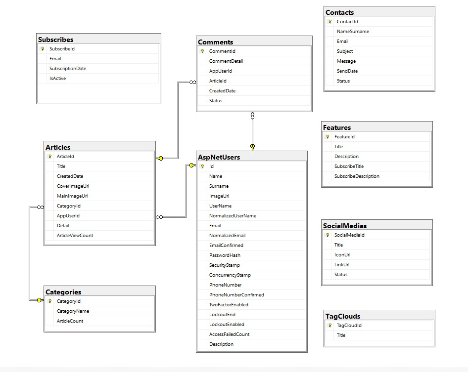
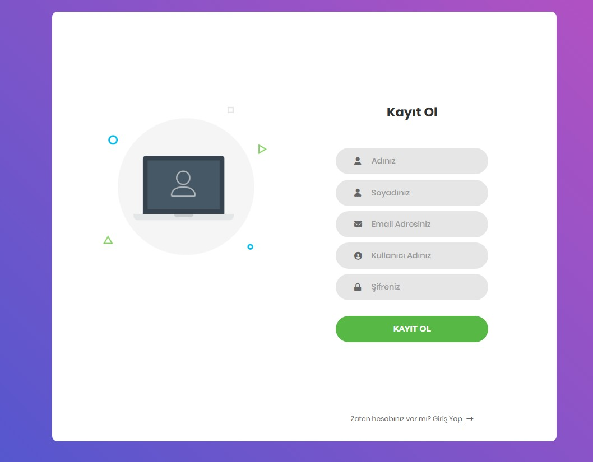
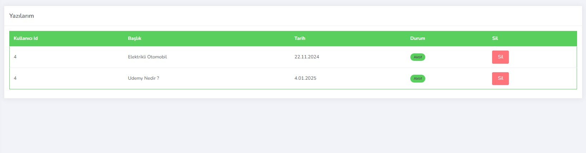
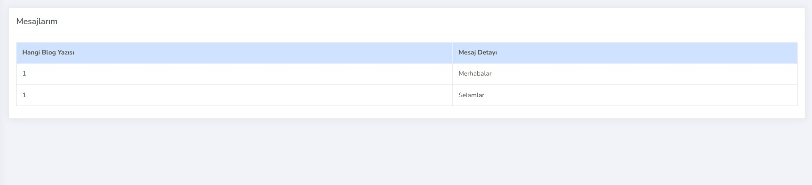
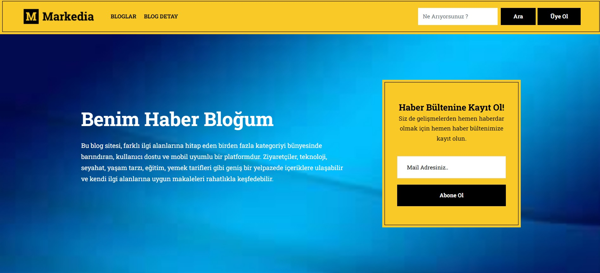
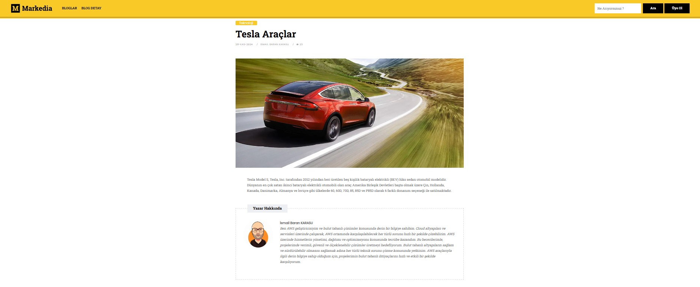
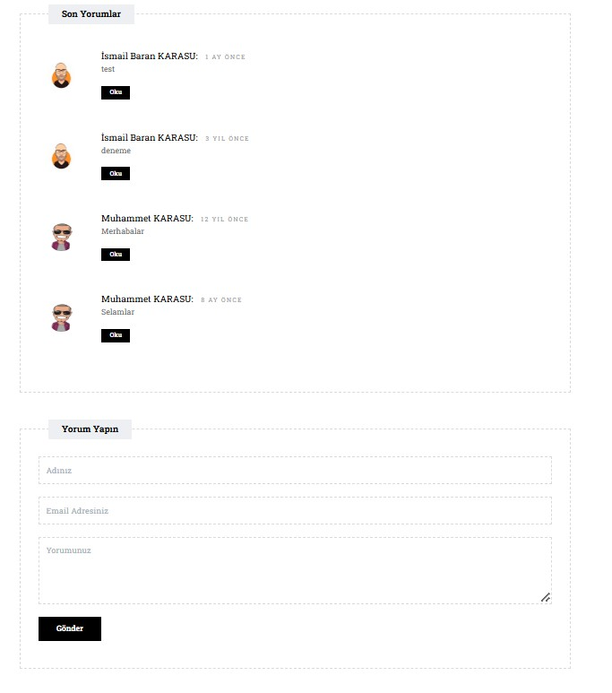

# MyBlogNight 🌙✍️

**MyBlogNight** projesi, .NET 6.0 ile geliştirilmiş, n katmanlı mimariye sahip modern ve kullanıcı dostu bir blog platformudur. Bu sistem, kullanıcıların kendi blog yazılarını oluşturup paylaşmasına ve içeriklerle etkileşimde bulunmasına olanak tanır. Kolay navigasyon, güçlü veri yönetimi ve dinamik içerik sunumu gibi özelliklerle zengin bir blog deneyimi sunar.
 
## Özellikler 🚀  
- **🌐 Kullanıcı Dostu Arayüz**: Modern ve mobil uyumlu tasarımı ile her cihazda rahatlıkla erişilebilir.
- **📝 Blog Yönetimi**: Kullanıcılar kendi blog yazılarını oluşturabilir, düzenleyebilir ve yayınlayabilir.
- **📂 Kategori ve Etiketler**: Yazılarınızı kategorilere ve etiketlere göre organize edebilir, benzer konulardaki içeriklerle kolayca etkileşim kurabilirsiniz.
- **💬 Yorum ve Sosyal Erişim**: Yazılarınıza gelen yorumları inceleyebilir ve sosyal medya üzerinden içeriklerinizi paylaşabilirsiniz.
- **⚙️ Gelişmiş Veritabanı İşlemleri**: Entity Framework ve Repository pattern ile veritabanı işlemleri esnek ve sürdürülebilir bir şekilde yönetilir.
- **🛡️ Fluent Validation**: Form işlemleri sırasında kullanıcı girişlerinin doğru ve eksiksiz olmasını sağlar.
- **📄 Sayfalama (X-PagedList)**: Uzun içerik listelerini hızlı ve sorunsuz bir şekilde sayfalara ayırarak performansı artırır.
- **🔧 Dependency Injection (Container)**: Bağımlılık yönetimi sayesinde kodun esnekliği artırılmıştır ve servisler daha temiz bir şekilde yönetilir.
- **🔐 Identity ile Kullanıcı Yönetimi**: Kayıt olma, oturum açma ve yetkilendirme işlemleri güvenli bir şekilde gerçekleştirilir.
- **📊 ViewModel ile Gereksiz Property Engelleme**: Görüntüleme katmanında sadece gerekli bilgilerin sunulmasını sağlar, performansı artırır.
- **⚙️ ViewComponent**: Dinamik içerikleri yönetmek ve tekrarlanan iş akışlarını kolaylaştırmak için kullanılır.
- **✉️ Mail Abonelik Sistemi**: Kullanıcıların yazılardan abonelik almasını sağlar ve alınan mailleri veritabanında saklar.
- **📦 Modüler Alanlar (Areas)**: Farklı alanlar ve projeler için ayrı ayrı yapıların tanımlandığı modüller.
- **🔌 Kapsamlı API Desteği**: Uygulama üzerinden RESTful API ile dış sistemlerle entegrasyon yapma imkanı sunar.

## Kullanılan Teknolojiler 🛠️

- **🔧 ASP.NET 6.0**: Dinamik ve modern web uygulamaları geliştirmek için kullanılan temel çerçeve.
- **🔗 n Katmanlı Mimari**: Kodun sürdürülebilir ve test edilebilir olmasını sağlar.
- **🔨 Repository Design Pattern**: Veritabanı işlemleri için bağımsız bir katman kullanımı sağlar.
- **⚙️ Entity Framework (Code First)**: SQL Server ile veritabanı işlemlerini kolayca yönetir.
- **🛡️ Fluent Validation**: Veri doğrulama işlemlerini güvenli ve esnek hale getirir.
- **📄 X-PagedList**: Veri listelerinin hızlı ve efektif şekilde sayfalama işlemlerini sağlar.
- **🔧 Dependency Injection (Container)**: Servis bağımlılıklarını yönetmek için kullanılan araç.
- **🔐 Identity**: Kullanıcı kimlik doğrulama işlemleri için Identity sistemi kullanılır.
- **📊 ViewModel**: Görünüm katmanında gereksiz property kullanımını azaltır.
- **📂 Areas**: Uygulama içerisindeki farklı konular için modüler yapı tanımlar.
- **⚙️ ViewComponent**: Dinamik veri parçalarını kontrol etmek için kullanılan bileşenler.
- **✉️ Mail Subscription**: Kullanıcıların abone ol butonu ile verdikleri mailleri veri tabanına kaydetme işlemleri yapılır.

## Ekran Görüntüleri 📸

### Veri Tabanı


### Login Sayfası



### Admin Paneli Görüntüsü




### Sweet Alert Görüntüsü


### Blog Görüntüsü



### Blog Detay Görüntüsü



## Kurulum ⚡
1. Projeyi klonlayın:
   ```bash
   git clone https://github.com/DifferenTismail/MyBlogNight.git

2. Proje klasörüne gidin:
    ```bash
    cd MyBlogNight

3. Veritabanı yapılandırmalarını yapın ve SQL Server üzerinde çalıştırın.

4. Uygulamayı çalıştırın:
    ```bash
    dotnet run

## Katkıda Bulunma

Katkıda bulunmak isterseniz, lütfen bir **pull request** açın. Her türlü katkı memnuniyetle karşılanır.
